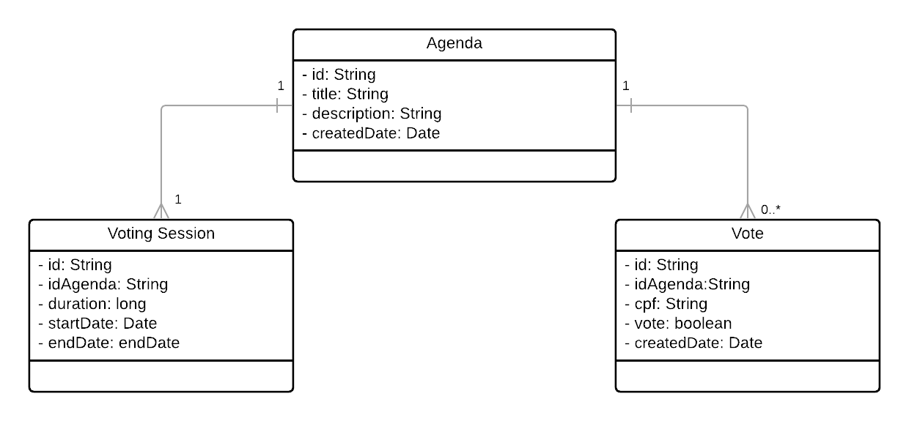

# Votação

## Objetivo

No cooperativismo, cada associado possui um voto e as decisões são tomadas em assembleias, por votação. Imagine que você
deve criar uma solução para dispositivos móveis para gerenciar e participar dessas sessões de votação.
Essa solução deve ser executada na nuvem e promover as seguintes funcionalidades através de uma API REST:

- Cadastrar uma nova pauta
- Abrir uma sessão de votação em uma pauta (a sessão de votação deve ficar aberta por
  um tempo determinado na chamada de abertura ou 1 minuto por default)
- Receber votos dos associados em pautas (os votos são apenas 'Sim'/'Não'. Cada associado
  é identificado por um id único e pode votar apenas uma vez por pauta)
- Contabilizar os votos e dar o resultado da votação na pauta

Para fins de exercício, a segurança das interfaces pode ser abstraída e qualquer chamada para as interfaces pode ser
considerada como autorizada. A solução deve ser construída em java, usando Spring-boot, mas os frameworks e bibliotecas
são de livre escolha (desde que não infrinja direitos de uso).

É importante que as pautas e os votos sejam persistidos e que não sejam perdidos com o restart da aplicação.

O foco dessa avaliação é a comunicação entre o backend e o aplicativo mobile. Essa comunicação é feita através de
mensagens no formato JSON, onde essas mensagens serão interpretadas pelo cliente para montar as telas onde o usuário vai
interagir com o sistema. A aplicação cliente não faz parte da avaliação, apenas os componentes do servidor. O formato
padrão dessas mensagens será detalhado no anexo 1.

## Como proceder

Por favor, realize o FORK desse repositório e implemente sua solução no FORK em seu repositório GItHub, ao final,
notifique da conclusão para que possamos analisar o código implementado.

Lembre de deixar todas as orientações necessárias para executar o seu código.

### Tarefas bônus

- Tarefa Bônus 1 - Integração com sistemas externos
    - Criar uma Facade/Client Fake que retorna aleátoriamente se um CPF recebido é válido ou não.
    - Caso o CPF seja inválido, a API retornará o HTTP Status 404 (Not found). Você pode usar geradores de CPF para
      gerar CPFs válidos
    - Caso o CPF seja válido, a API retornará se o usuário pode (ABLE_TO_VOTE) ou não pode (UNABLE_TO_VOTE) executar a
      operação. Essa operação retorna resultados aleatórios, portanto um mesmo CPF pode funcionar em um teste e não
      funcionar no outro.

```
// CPF Ok para votar
{
    "status": "ABLE_TO_VOTE
}
// CPF Nao Ok para votar - retornar 404 no client tb
{
    "status": "UNABLE_TO_VOTE
}
```

Exemplos de retorno do serviço

### Tarefa Bônus 2 - Performance

- Imagine que sua aplicação possa ser usada em cenários que existam centenas de
  milhares de votos. Ela deve se comportar de maneira performática nesses
  cenários
- Testes de performance são uma boa maneira de garantir e observar como sua
  aplicação se comporta

### Tarefa Bônus 3 - Versionamento da API

○ Como você versionaria a API da sua aplicação? Que estratégia usar?

## O que será analisado

- Simplicidade no design da solução (evitar over engineering)
- Organização do código
- Arquitetura do projeto
- Boas práticas de programação (manutenibilidade, legibilidade etc)
- Possíveis bugs
- Tratamento de erros e exceções
- Explicação breve do porquê das escolhas tomadas durante o desenvolvimento da solução
- Uso de testes automatizados e ferramentas de qualidade
- Limpeza do código
- Documentação do código e da API
- Logs da aplicação
- Mensagens e organização dos commits

## Dicas

- Teste bem sua solução, evite bugs
- Deixe o domínio das URLs de callback passiveis de alteração via configuração, para facilitar
  o teste tanto no emulador, quanto em dispositivos fisicos.
  Observações importantes
- Não inicie o teste sem sanar todas as dúvidas
- Iremos executar a aplicação para testá-la, cuide com qualquer dependência externa e
  deixe claro caso haja instruções especiais para execução do mesmo
  Classificação da informação: Uso Interno

## Anexo 1

### Introdução

A seguir serão detalhados os tipos de tela que o cliente mobile suporta, assim como os tipos de campos disponíveis para
a interação do usuário.

### Tipo de tela – FORMULARIO

A tela do tipo FORMULARIO exibe uma coleção de campos (itens) e possui um ou dois botões de ação na parte inferior.

O aplicativo envia uma requisição POST para a url informada e com o body definido pelo objeto dentro de cada botão
quando o mesmo é acionado. Nos casos onde temos campos de entrada
de dados na tela, os valores informados pelo usuário são adicionados ao corpo da requisição. Abaixo o exemplo da
requisição que o aplicativo vai fazer quando o botão “Ação 1” for acionado:

```
POST http://seudominio.com/ACAO1
{
    “campo1”: “valor1”,
    “campo2”: 123,
    “idCampoTexto”: “Texto”,
    “idCampoNumerico: 999
    “idCampoData”: “01/01/2000”
}
```

Obs: o formato da url acima é meramente ilustrativo e não define qualquer padrão de formato.

### Tipo de tela – SELECAO

A tela do tipo SELECAO exibe uma lista de opções para que o usuário.

O aplicativo envia uma requisição POST para a url informada e com o body definido pelo objeto dentro de cada item da
lista de seleção, quando o mesmo é acionado, semelhando ao funcionamento dos botões da tela FORMULARIO.

# desafio-votacao

### Sobre o desenvolvimento

O desafio foi desenvolvido com Spring boot, Gradle e MongoDB como banco de dados. A escolha de tais
ferramentas se deu pela familiaridade com as tecnologias, visando assim um desenvolvimento mais rápido.
Antes de fato codificar, foram feitas pesquisas e modelagens sobre como fazer api. O primeiro ponto foi a escolha de
desenvolver todo o código em inglês, depois a modelagem dos dados.

#### Tradução escolhida para as entidades do projeto

- Pauta -> Agenda
- Voto -> vote
- Sessão de votação -> Voting Session

#### Modelagem de dados



#### Instruções de uso

A aplicação desenvolvida possui duas dependencias para rodar. Banco de dados MongoDB e o validador de cpf
fake (https://github.com/cassiorp/fake-cpf-validator), serviço que valida de forma randomica se um cpf é valido ou não.
É possivel rodar toda infraestrutura para via docker-compose. Para isso é necessário ter instalado  ````Docker ````
e  ````docker-compose ```` em seu computador.

Clone o repositório e navegue até a pasta docker/app:

`````
cd desafio-votacao/docker/app
````` 

Depois rode o comando:

````
sudo docker-compose up
````

Três containers (desafio-votacao, mongo_db e cpfvalidator) irão ser instanciados, o banco de dados irá criar um volume
dentro do diretório ````desafio-votacao/docker/mongo-data```` assim os dados não irão se perder ao reiniciar a aplicação. E você
pode acessar a documentação da aplicação pela url: http://localhost:5000/swagger-ui/index.html

Também é possivel rodar apenas as dependencias do projeto e rodar a aplicação em sua IDE de preferência, para isso rode
o comando ````sudo docker-compose up```` dentro do diretório ````desafio-votacao/docker/dependencies````

Collection postman: https://drive.google.com/file/d/1eF9EoUfWbLu1EjegfxKwYPdvKsjokHpb/view?usp=sharing
## API

| Rota                                | Metodo | Descricao                                                                                                                                                                                                                                                                                                                                        |
|-------------------------------------|--------|--------------------------------------------------------------------------------------------------------------------------------------------------------------------------------------------------------------------------------------------------------------------------------------------------------------------------------------------------|
| `/api/v1/agenda`                    | POST   | Criar uma pauta com titulo e descrição                                                                                                                                                                                                                                                                                                           |
| `/api/v1/agenda`                    | GET    | Busca todas as pautas cadastradas                                                                                                                                                                                                                                                                                                                |
| `/api/v1/agenda/{id}`               | GET    | Busca agenda por id unico do banco                                                                                                                                                                                                                                                                                                               |
| `/api/v1/agenda/{id}/voting/status` | GET    | Busca a situação da votação de um pauta por id. O retorno vem com as datas de abertura de fim da votação, total de votos, votos contra, votos a favor e campo `votingStatus` que traz a situação da votação que pode ser `OPEN, APPROVED, DISAPPROVED, TIED`.                                                                                    |
| `/api/v1/voting-session`            | POST   | Cria uma sessão de votação. Existem dois campos na criação da sessão: ```idAgenda: String``` que é obrigatório e precisa ser de uma pauta existente. E ```duration: Long``` tempo de duração da votação em ***millisegundos***. Não é obrigatório e por default é 60000(1 minuto)                                                                |
| `/api/v1/voting-session/{id}`       | GET    | Busca sessão de votação por id unico do banco                                                                                                                                                                                                                                                                                                    |
| `/api/v1/vote`                      | POST   | Método para votação. Possui os campos ```vote: Boolean```, ```cpf: String```, ```idAgenda: String``` (todos obrigatórios). A validação do cpf é feita de forma aleatória por um serviço externo. Caso o formato do cpf seja invalido, sempre ira retornar UNABLE_TO_VOTE. Caso seja valido será feito random entre ABLE_TO_VOTE e UNBALE_TO_VOTE |