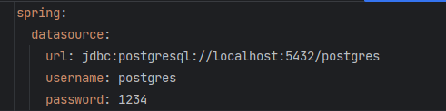

# votacao-api
___________________________________________________________________________________
Este sistema tem como objetivo criar e gerenciar a votação de usuários associados.

### Dependências

* Java 17

### Para rodar a aplicação

1. rodar "./gradlew clean build"
2. rodar java "java -jar build/libs/votacao-api-0.0.1-SNAPSHOT.jar"

### Técnologias utilizadas

* Java 17
* Gradle
* H2
* Postgres
* SpringBoot
* Lombok

## Configuração

### Configuração do banco de dados:

Configure sua conexão de banco de dados PostgreSQL em 
src/main/resources/application.yml.

### Uso

#### Usando Docker Compose para PostgreSQL
Execute o seguinte comando para iniciar o contêiner PostgreSQL:

`docker-compose up -d`

Seu banco de dados PostgreSQL agora deve estar em execução em um contêiner Docker.

