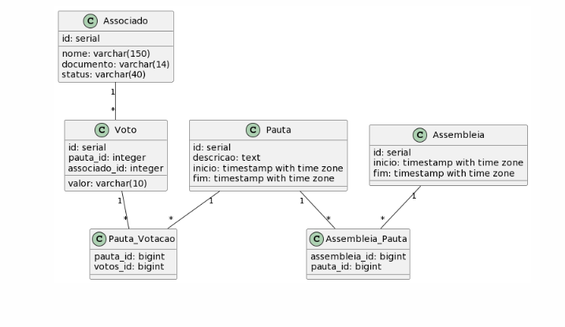

<p align="center">
  <h1 align="center">Sistema de Assembleia</h1>
</p>

<p align="center">
  
  [](https://opensource.org/licenses/Apache-2.0)
  
</p>

## Tabela de Conteúdo

- [Sobre o Projeto](#sobre-o-projeto)
- [Funcionalidades](#funcionalidades)
- [Tecnologias](#tecnologias)
- [Modelo de Dados](#modelo-de-dados)
- [Pré-Requisitos](#pré-requisitos)
- [Como Rodar](#como-rodar)
- [Considerações Finais](#considerações-finais)

## Sobre o Projeto

Esse projeto tem como objetivo implementar um sistema para gerenciar a realização de assembleias, pautas e votações por associados.

## Funcionalidades

O sistema permite:

- Cadastrar e consultar associados
- Cadastrar  e consultar assembleias
- Cadastrar  e consultar pautas
- Registrar votos dos associados nas pautas durante as assembleias
- Gerar relatórios com os resultados das votações

## Tecnologias

O sistema foi desenvolvido utilizando as seguintes tecnologias:

- Linguagem de programação: Java 17
- Banco de dados: PostgreSQL 12
- Framework: SpringBoot
- Gerenciador: Maven
- Serviço de Mensageria: RabbitMQ
- Versionamento de Banco: Flyway
- Interface para manipulação do banco: PgAdmin
- Documentação: Swagger
- Conversão de entidades: MapStruct
- Comunicação externa: FeignClient
- Testes de comunicação externa: FeignMock
- Testes unitarios: JUnit
- Testes de Integração: MockMvc

## Pré-Requisitos

Antes de começar, você precisará ter o Docker instalado em sua máquina.<br>

## Como Rodar

É necessário que você execute o seguinte comando dentro das pastas "docker/rabbitmq" e "docker/database" para subir os serviços em container:
`````
docker-compose up -d
`````
Isso irá subir os serviços de Banco de Dados e RabbitMQ em container.<br>
OBS: gAdmin não é necessário, apenas caso não tenha acesso a nenhuma plataforma para o PostgreSQL.<br>
Os serviços ficaram disponiveis em:

# [Swagger](http://localhost:8080/swagger-ui/index.html)
`````
http://localhost:8080/swagger-ui/index.html
`````

# PgAdmin : [localhost:8090](http://localhost:8090) com as credenciais:
`````
user: admin@email.com
senha: root
`````
# RabbitMQ:  [localhost:15672](http://localhost:15672)  com as credenciais:
`````
user: admin
senha: 123456
`````

## Modelo de Dados

Abaixo segue o modelo de dados do sistema:

```plantuml
class Associado {
  id: serial
  nome: varchar(150)
  documento: varchar(14)
  status: varchar(40)
}

class Assembleia {
  id: serial
  inicio: timestamp with time zone
  fim: timestamp with time zone
}

class Pauta {
  id: serial
  descricao: text
  inicio: timestamp with time zone
  fim: timestamp with time zone
}

class Voto {
  id: serial
  pauta_id: integer
  associado_id: integer
  valor: varchar(10)
}

class Assembleia_Pauta {
  assembleia_id: bigint
  pauta_id: bigint
}

class Pauta_Votacao {
  pauta_id: bigint
  votos_id: bigint
}
```

# Considerações Finais
